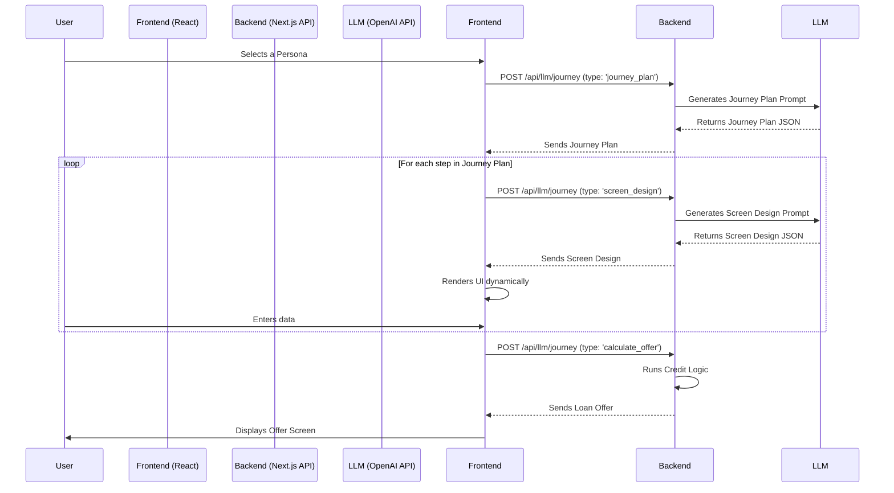

# MoneyView GenUI POC - Project Nova

This repository contains the Proof of Concept for Project Nova, a generative UI system for MoneyView's loan application journeys. The goal is to create dynamic, personalized user experiences driven by a Large Language Model (LLM) based on pre-defined user personas.

## 🚀 Core Concept

The system uses a two-role LLM architecture to act as a "GenUI Engine":
1.  **UX Architect (Role 1):** Based on a selected user persona, this role designs a high-level, multi-step `journey_plan` (e.g., a short, streamlined form vs. a guided, conversational chat).
2.  **UI Designer (Role 2):** For each step in the `journey_plan`, this role designs a detailed `screen_design`, specifying the exact components, layout, text, and validation rules needed to render the UI.

The frontend is a "dumb" renderer that simply takes these JSON blueprints and displays the corresponding UI, creating a fully dynamic experience.

---

## 📊 Project Status (As of last update)

The POC is approximately **75% complete**. The complex backend engine is finished and stable, and the foundational frontend is in place. The remaining work is primarily focused on frontend UI polish and feature completion.

### ✅ Completed Milestones

*   **Project Foundation:**
    *   Next.js 15 project setup with TypeScript.
    *   Git repository with `main` and `demo-base` branches.
    *   Integration of the local `mv-pbds` MoneyView design system via path aliasing.
*   **GenUI Backend Engine:**
    *   **LLM Integration:** Successfully switched from a local `llama2` model to the OpenAI API (`gpt-3.5-turbo`) for reliable, structured JSON output.
    *   **Two-Role Architecture:** Both `getJourneyPlan` (Architect) and `getScreenDesign` (Designer) functions are implemented and tested.
    *   **Robust Response Handling:** The `LLMService` can reliably parse, clean, and validate complex JSON responses from the LLM.
    *   **Dynamic Journey Generation:** End-to-end tests confirm the engine generates unique, multi-step journey plans and screen designs for all 6 user personas.
*   **Core Application Logic:**
    *   **API Layer:** A robust Next.js API route (`/api/llm/journey`) handles all communication between the frontend and the LLM service.
    *   **Credit Logic:** A dummy `calculateLoanOffer` function is implemented on the backend to simulate offer generation.
*   **Frontend Foundation:**
    *   **State Management:** A `useJourneyOrchestrator` hook manages the entire application state (current persona, step, user data, etc.).
    *   **Dynamic Rendering:** A `Component Registry` and `DynamicStepRenderer` are in place to render UI from the LLM's JSON.

### 📝 Pending Items & Next Steps

1.  **Frontend UI Polish & Theming:**
    *   Apply the full MoneyView theme (fonts, colors, component styles) from the design system.
    *   Refine the layout of `MainLayout.tsx` and `DynamicStepRenderer.tsx` to exactly match the provided reference designs.
    *   Implement custom styling for specific components like the `RadioButtonGroup`.
2.  **Complete Frontend Functionality:**
    *   Wire up the `Slider` component for the "Amount Selection" step.
    *   Implement client-side validation based on the rules provided in the `screen_design` JSON.
    *   Ensure user data is correctly passed between all steps.
3.  **Finalize Journey Steps:**
    *   Implement the UI for the "PAN Confirm" step (displaying a dummy PAN).
    *   Ensure the `OfferDisplay` and `JourneyComplete` screens are fully styled.

---

## ⚙️ How to Run the Project

### Prerequisites
*   Node.js (v18 or later)
*   npm
*   An OpenAI API Key

### 1. Installation

Clone the repository and install the dependencies.
```bash
git clone <your-repo-url>
cd nova-poc
npm install
```

### 2. Environment Setup

1.  Create a file named `.env.local` in the root of the project.
2.  Add your OpenAI API key to this file:
    ```
    OPENAI_API_KEY="sk-..."
    ```

### 3. Running the Development Server

Start the Next.js development server.
```bash
npm run dev
```
The application will be available at `http://localhost:3000` (or the next available port).

### 4. Running Backend Tests

To test the LLM integration directly without running the full UI, use the `tsx` script.
```bash
# Make sure dotenv is loaded to provide the API key
npx tsx -r dotenv/config src/backend/services/llm/test-all-personas.ts dotenv_config_path=./.env.local
```

---

## 🌊 Application Flow


